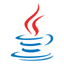
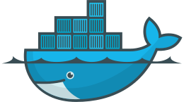

<!-- SHIELDS -->
<!-- http://shields.io -->

#### Info
<!-- - 🔭 I’m currently working on [Lite XL Project Template Manager](https://github.com/PerilousBooklet/lite-xl-ptm) -->
- 🔭 I’m currently working on [Lite XL IDE](https://github.com/PerilousBooklet/lite-xl-ide)
- 🌱 I’m currently learning Lua and C
<!-- - 👯 I’m looking to collaborate on ? -->
<!-- - 🤔 I’m looking for help with documenting Lite XL -->
<!-- - 💬 Ask me about Arch Linux, ? -->
- 📫 How to reach me: @perilousbooklet:matrix.org
- 😄 Pronouns: he/him

#### Open source operating systems that I use
[][arch]

 

<!-- #### Open source services that I use -->
<!-- [Fontello](https://fontello.com/) -->
<!-- [Excalidraw](https://excalidraw.com/) -->

#### Open source apps that I use
[][firefox]
[][thunderbird]
[][keepassxc]
[][element-desktop]
[][zulip]
[][freetube]
[][xournalpp]
[][lite-xl]
[][godot]
[][lutris]
[][heroic-games-launcher]

 

<!-- #### Programming languages that I use -->
<!-- 
 -->
<!--   [][cpp] -->
<!--   [][java] -->
<!--   [][bash] -->
<!--   [][tex] -->
<!--   [][r] -->
<!--   [][lua] -->
<!--   [][html] -->
<!--   [][css] -->
<!-- 
 -->

<!-- #### Tools that I use -->
<!-- 
 -->
<!--   [][git] -->
<!--   [][ssh] -->
<!--   [][tmux] -->
<!--   [][docker] -->
<!-- 
 -->

<!--   -->

#### Open source games that are actually good
[][mindustry]
[][veloren]
[][0ad]
[][xonotic]
[][supertuxkart]
[][wesnoth]
[][warzone2100]

<!-- Bibliography -->

<!-- Operating systems -->
[arch]: https://archlinux.org/
[linux-mint]: https://www.linuxmint.com/

<!-- Apps -->
[firefox]: https://www.mozilla.org/en-US/firefox/new/
[thunderbird]: https://www.thunderbird.net/en-US/
[keepassxc]: https://keepassxc.org/
[element-desktop]: https://element.io/
[zulip]: https://zulip.com/
[freetube]: https://freetubeapp.io/
[xournalpp]: https://xournalpp.github.io/
[lite-xl]: https://lite-xl.com/
[godot]: https://godotengine.org/
[lutris]: https://lutris.net/
[heroic-games-launcher]: https://heroicgameslauncher.com/

[mindustry]: https://mindustrygame.github.io/
[veloren]: https://veloren.net/
[0ad]: https://play0ad.com/
[xonotic]: https://xonotic.org/
[supertuxkart]: https://supertuxkart.net/Main_Page
[wesnoth]: https://www.wesnoth.org/
[warzone2100]: https://wz2100.net/

<!-- Programming Languages -->
[cpp]: 
[java]: 
[bash]: 
[lua]: 
[tex]: 
[r]: 
[html]: 
[css]: 

<!-- Tools -->
[git]: 
[ssh]: 
[tmux]: 
[docker]: 

<!-- Hardware -->
[laptop]: https://laptopwithlinux.com/
[zimaboard216]: https://shop.zimaboard.com/products/zimaboard-single-board-server

<!-- Books -->
<!-- [b1]:  -->
 
<!--
**PerilousBooklet/PerilousBooklet** is a ✨ _special_ ✨ repository because its `README.md` (this file) appears on your GitHub profile.

Here are some ideas to get you started:

- 🔭 I’m currently working on ...
- 🌱 I’m currently learning ...
- 👯 I’m looking to collaborate on ...
- 🤔 I’m looking for help with ...
- 💬 Ask me about ...
- 📫 How to reach me: ...
- 😄 Pronouns: ...
- ⚡ Fun fact: ...
-->
