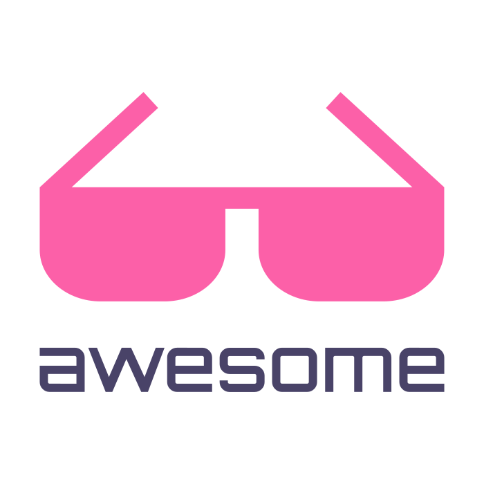

<!-- SHIELDS -->
<!-- http://shields.io -->

#### Info

- 🔭 I’m currently working on [Lite XL IDE](https://github.com/PerilousBooklet/lite-xl-ide)
- 🌱 I’m currently learning Lua
- 💬 Ask me about Computers, Linux and things about Italy
- 📫 How to reach me: @perilousbooklet:matrix.org

#### Important Projects

[][awesome]

 

#### Open source operating systems that I use

[][arch]

 

#### Open source apps that I use

[][firefox]
[][thunderbird]
[][keepassxc]
[][keepassdx]
[][element-desktop]
[][zulip]
[][freetube]
[][xournalpp]
[][lite-xl]
[][lutris]
[][heroic-games-launcher]
[][prismlauncher]

<!-- [][gimp] -->
<!-- [][inkscape] -->
<!-- [][krita] -->
<!-- [][blender] -->
<!-- [][material-maker] -->
<!-- [][godot] -->
<!-- [][olive] -->
<!-- [][natron] -->
<!-- [][obs] -->
<!-- [][tenacity] -->
<!-- [][ardour] -->
<!-- [][lmms] -->

<!-- [][openscad] -->
<!-- [][freecad] -->
<!-- [][kicad] -->

 

<!-- #### Open source hardware that I use -->
<!-- [][mnt-reform-next] -->

<!--   -->

#### Open source games that are actually good

[][mindustry]
[][veloren]
[][0ad]
[][xonotic]
[][supertuxkart]
[][wesnoth]
[][warzone2100]
[][flightgear]
[][shattered-pixel-dungeon]
[][rigsofrods]

<!-- Bibliography -->

<!-- Operating systems -->
[arch]: https://archlinux.org/
[linux-mint]: https://www.linuxmint.com/

<!-- Apps -->
[firefox]: https://www.mozilla.org/en-US/firefox/new/
[thunderbird]: https://www.thunderbird.net/en-US/
[keepassxc]: https://keepassxc.org/
[keepassdx]: https://www.keepassdx.com/
[element-desktop]: https://element.io/
[zulip]: https://zulip.com/
[freetube]: https://freetubeapp.io/
[xournalpp]: https://xournalpp.github.io/
[lite-xl]: https://lite-xl.com/
[lutris]: https://lutris.net/
[heroic-games-launcher]: https://heroicgameslauncher.com/
[prismlauncher]: https://prismlauncher.org/

[gimp]: https://www.gimp.org/
[inkscape]: https://inkscape.org/
[krita]: https://krita.org/en/
[blender]: https://www.blender.org/
[material-maker]: https://www.materialmaker.org/
[godot]: https://godotengine.org/
[olive]: https://www.olivevideoeditor.org/
[natron]: https://natrongithub.github.io/
[obs]: https://obsproject.com/
[tenacity]: https://tenacityaudio.org/
[ardour]: https://ardour.org/
[lmms]: https://lmms.io/

[openscad]: https://openscad.org/
[freecad]: https://openscad.org/
[kicad]: https://openscad.org/

[mindustry]: https://mindustrygame.github.io/
[veloren]: https://veloren.net/
[0ad]: https://play0ad.com/
[xonotic]: https://xonotic.org/
[supertuxkart]: https://supertuxkart.net/Main_Page
[wesnoth]: https://www.wesnoth.org/
[warzone2100]: https://wz2100.net/
[flightgear]: https://www.flightgear.org/
[rigsofrods]: https://rigsofrods.org/
[shattered-pixel-dungeon]: https://shatteredpixel.com/shatteredpd/

[awesome]: https://github.com/sindresorhus/awesome
